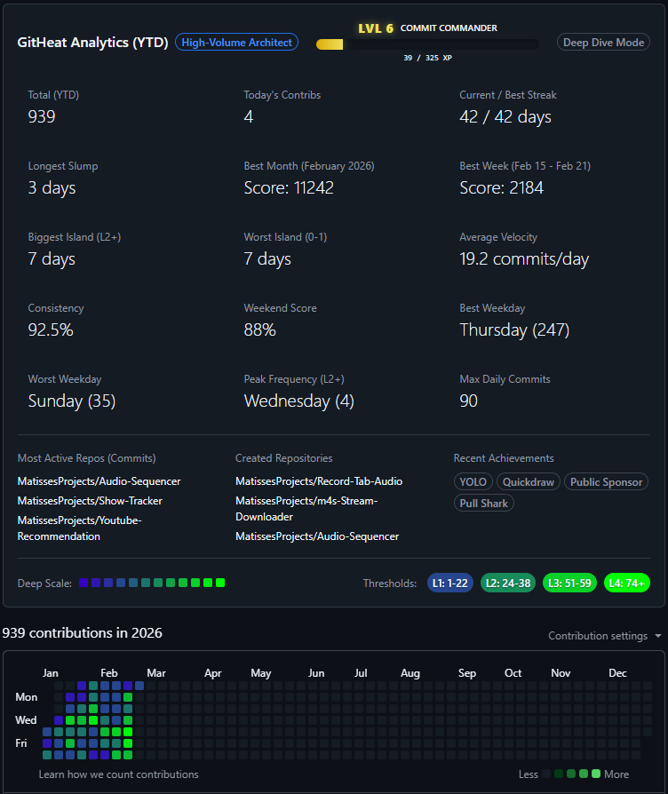

# GitHeat (GitHub Pulse)

A Chrome extension that turns your GitHub contribution graph into a deep-dive analytical dashboard and gamified experience.

## Core Features

### RPG Gamification
- **Leveling System:** Earn XP through commits. Progress through levels with titles from "Novice" to "Code God."
- **Bonus XP:** 
  - **Multi-Commit Bonus:** Get extra XP for 5+ contributions in a single day.
  - **Reviewer Bonus:** Earn massive XP (+3 per review) for performing Code Reviews.
  - **Velocity Bonus:** Gain +2 XP if today's commits exceed your daily average velocity.
- **Combo System:** Achieve a **COMBO x#** badge in the header for high daily activity (2+ contributions). The badge features a fiery animation and dynamic "Combo Reasons" like:
  - **Multi-Tasker:** For doing commits, PRs, and reviews in one day.
  - **Guardian of Code:** For focusing on Code Reviews.
  - **Commit Frenzy:** For high-volume commit days.
  - **Problem Solver:** For combining PRs and Issues.
  - **Architect:** For creating new repositories.
- **Progress Tracking:** A sleek, high-contrast progress bar in the panel header shows exactly how much XP you need for the next level.

### Advanced Analytics
- **Best Month & Week:** Automatically identifies your peak performance periods using a smart score based on volume, consistency, and streaks.
- **Island Discovery:** 
  - **Biggest Island (L2+):** Find your largest cluster of high-intensity work.
  - **Worst Island (0-1):** Identify your most significant slumps with a unique "sad" shrinking animation.
- **Weekday Deep-Dive:** See which days of the week you are most productive, both by total count and average volume.
- **Precision Metrics:** Track your Velocity (commits/day), Consistency %, and Weekend Score.

### Deep Scale & Themes
- **12-Level Heatmap:** Re-calculates your contribution graph into 12 granular levels (instead of the standard 5) using percentile-based scaling.
- **Color Themes:** Toggle between "Classic Green," "Flame Heat," or create your own **Custom Range** with a built-in color picker.
- **Legend Decoding:** Displays the exact commit ranges for every level directly in the GitHub legend.

### Customizable UI
- **Drag-and-Drop Reordering:** Use the extension popup to reorder your analytics grid cards to prioritize what matters most to you.
- **Granular Toggles:** Hide or show any section (Persona, Active Repos, Achievements) or individual grid items.
- **Interactive Highlighting:** Hover over any card (Streak, Island, Best Week) to highlight those specific days directly on your contribution graph.

## How to Load
1. Clone this repository.
2. Run `npm install` and `npm run build`.
3. Open Chrome and go to `chrome://extensions/`.
4. Enable **Developer mode** (top right).
5. Click **Load unpacked**.
6. Select the `dist` folder in this project directory.

## Development
- **Tech Stack:** TypeScript, CSS, Chrome Extension API.
- **Source:** All logic is in `src/content.ts` (scraping/injection) and `src/popup.ts` (UI/settings).
- **Build:** `npm run build` compiles TypeScript and syncs assets to `dist/`.
