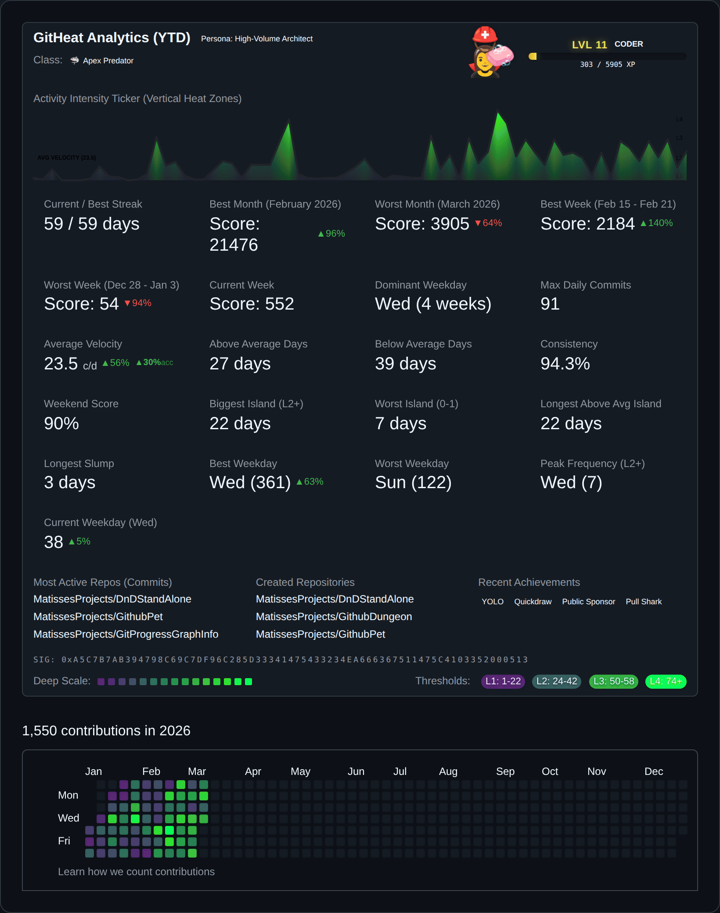

# GitHeat (GitHub Pulse)

A Chrome extension that turns your GitHub contribution graph into a deep-dive analytical dashboard and a fully gamified RPG experience.



## Core Features

### ⚔️ RPG Gamification & Hero Avatar
- **Evolving Avatar:** Your profile now features a dynamic RPG hero that evolves as you level up. The avatar is visually assembled with layered gear:
  - **Evolution:** Your base character changes from a "Newbie" to a "Code God" as you gain levels.
  - **Daily Weaponry:** Reflects today's commit volume (Stick ➔ Club ➔ Sword ➔ Battle Axe ➔ Lightning).
  - **Defensive Gear:** Gain shields based on your PR Review activity.
  - **Legendary Headgear:** Long streaks unlock rare crowns and helmets.
  - **Companions:** Higher star counts attract loyal pets and dragons.
- **Leveling System:** Earn XP through commits. Progress through 20+ levels with unique titles.
- **Bonus XP & Buffs:** 
  - **Multi-Commit Bonus:** Extra XP for 5+ contributions in a day.
  - **Reviewer Bonus:** Gain massive XP (+3 per review).
  - **Skill Tree Bonuses:** Earn permanent **+20 XP** and **+1 Daily Combo point** for every skill unlocked.
- **Combo System:** Achieve a **COMBO x#** badge for high daily activity. The badge features a fiery animation and dynamic reasons like "Guardian of Code" or "Architect."

### 🌲 Branching Skill Tree
- **Milestone Unlocks:** Explicitly unlock skills by reaching specific GitHub milestones.
- **Three Disciplines:** Skills are categorized into **Coding** (e.g., System Architect, Lead Maintainer), **Social** (e.g., Eagle Eye Reviewer, Socialite), and **Consistency** (e.g., Code Marathoner).
- **Expandable View:** A space-saving, expandable Skill Tree panel lets you track your long-term goals without cluttering your profile.
- **Permanent Power-ups:** Unlocked skills provide permanent stat boosts to your XP and daily combo scores.

### 📊 Advanced Analytics & Ticker
- **Activity Intensity Ticker:** A high-resolution horizontal line graph showing your daily commit intensity.
  - **Average Velocity Line:** A visual reference line representing your overall YTD average velocity.
  - **Dynamic Colorization:** The area under the graph is colorized based on each day's specific contribution level.
- **Precision Metrics:**
  - **Current Week Progress:** Track your ongoing performance for the current week in real-time.
  - **Worst Month:** Identifies your lowest-activity periods with multi-month highlighting support.
  - **Island Discovery:** Find your largest clusters of high-intensity work or significant slumps.
- **Scoped Scaling:** Analytics are accurately scoped to the year you are currently viewing, including full support for previous years.

### 🎨 Deep Scale & Themes
- **15-Level Heatmap:** Re-calculates your contribution graph into 15 granular levels using data-driven quantile scaling.
- **Pulse Signature (SIG):** A unique hexadecimal string (e.g., `0x5A3...`) representing your activity levels. Hovering over any character highlights matching days on the graph.
- **Custom Themes:** Toggle between predefined themes (Flame, Ocean, Sunset) or use the **Custom Range** picker to match your personal aesthetic.
- **Multi-Way Highlighting:** Full synchronization between the Graph, the Legend, and the Pulse Signature.

### ⚙️ Full Customization
- **Total Control:** Every single element (Avatar, Skill Tree, Ticker, SIG, etc.) can be toggled on or off via the extension popup.
- **Custom Gear:** Set your own **Emojis**, **Image URLs**, or **Labels** for your avatar's growth tiers.
- **Drag-and-Drop Reordering:** Move your analytics grid cards to prioritize the stats that matter most to you.

## How to Load
1. Clone this repository.
2. Run `npm install` and `npm run build`.
3. Open Chrome and go to `chrome://extensions/`.
4. Enable **Developer mode** (top right).
5. Click **Load unpacked**.
6. Select the `dist` folder in this project directory.

## GitHub Profile Updater (GitHub Action)

You can automatically update a GitHeat analytics image for your GitHub profile README using a GitHub Action.

### Setup
1. Fork or clone this repository to your own GitHub account.
2. The GitHub Action is located in `.github/workflows/update-githeat.yml`.
3. It runs automatically every day at midnight UTC, but you can also trigger it manually from the **Actions** tab.
4. The action will generate a `githeat.gif` file in the root of your repository.

### Usage in Profile README
To display your GitHeat analytics in your GitHub profile README, add the following Markdown:

```markdown
[](https://github.com/YOUR_USERNAME/GitProgressGraphInfo)
```

Replace `YOUR_USERNAME` with your GitHub username.

## Development
- **Tech Stack:** TypeScript, CSS, Chrome Extension API.
- **Source:** All logic is in `src/content.ts` (scraping/injection) and `src/popup.ts` (UI/settings).
- **Build:** `npm run build` compiles TypeScript and syncs assets to `dist/`.
